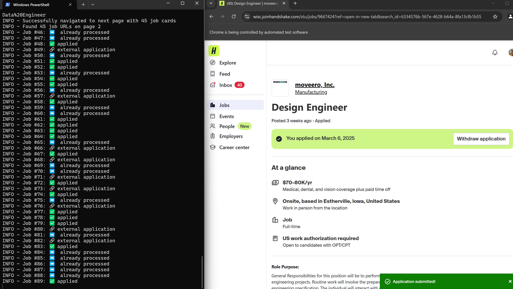

# 🤖 🤝 Handshake Job Bot



A magical bot that automatically applies to jobs on Handshake so you can focus on more important things... like preparing for those interviews you're about to get 😉

This bot: 

- Automatically applies to jobs on Handshake
- Skips jobs you've already applied to
- Handles external application links
- Fills out basic application forms
- Logs all applied jobs for tracking

## 🛠️ Setup

1. Clone this repository
2. Install dependencies: `pip install -r requirements.txt`
3. Update `config/config.json` with your job search preferences:
   ```json
   {
     "job_search": {
       "titles": ["Software Engineer", "Data Scientist", "Product Manager"]
     }
   }
   ```
   Add as many job titles as you want to search for!
4. Update the constants in `src/constants.py` to match your resume, cover letter, and transcript file names in handshake:
   ```python
   XPATH_RESUME_BUTTON = "//button[contains(@aria-label, 'your-resume-filename.pdf')]"
   XPATH_COVERLETTER_BUTTON = "//button[contains(@aria-label, 'your-coverletter-filename')]"
   XPATH_TRANSCRIPT_BUTTON = "//button[contains(@aria-label, 'your-transcript-filename.pdf')]"
   ```

## 🚀 Usage Options

### ✨ Option 1: Use Your Existing Browser (RECOMMENDED)

This is the easiest and most reliable method! You get to log in manually and set up filters exactly how you want them.

#### 🪟 Windows:
1. Close ALL Chrome windows (important!)
2. Open Command Prompt and navigate to Chrome:
   ```
   cd "C:\Program Files\Google\Chrome\Application"
   ```
   (or `C:\Program Files (x86)\Google\Chrome\Application` for 32-bit)
3. Start Chrome in incognito mode with debugging:
   ```
   chrome.exe --remote-debugging-port=9222 --incognito
   ```
   (or `.\chrome.ext --remote-debugging-port=9222 --incognito`)

#### 🍎 Mac:
1. Close ALL Chrome windows
2. Open Terminal and run:
   ```
   /Applications/Google\ Chrome.app/Contents/MacOS/Google\ Chrome --remote-debugging-port=9222 --incognito
   ```

#### Next steps (all platforms):
4. Chrome should open. Now log into Handshake using your institution's login
5. Navigate to the Jobs panel
6. Set ALL your desired filters (full-time, internship, location, etc.)
7. Click "Show Results" to see your filtered jobs
8. In a separate terminal, run:
   ```
   python src/main.py --use-existing
   ```
9. Sit back and watch the magic happen! ✨

### 🤔 Option 2: Fully Automated (Legacy Method)

This method requires more setup and may be less reliable with institution logins.

1. Create a `.env` file in the root directory with your credentials:
   ```
   HANDSHAKE_NETID=your_netid_or_username
   HANDSHAKE_PASSWORD=your_password
   ```
   Note: These are the credentials for logging into your institution, not Handshake directly.

2. Find your institution's Handshake login URL:
   - Open a new Chrome window
   - Navigate to Handshake and select your institution
   - Copy the login URL (example: `https://wisc.joinhandshake.com/login`)
   - Add it to `config/config.json`:
     ```json
     "handshake": {
       "login_url": "https://yourinstitution.joinhandshake.com/login"
     }
     ```

3. Set up your filtered search URL:
   - Log into Handshake
   - Set all your desired job filters
   - Click "Show Results"
   - Copy the entire URL from your address bar
   - Add it to `config/config.json`:
     ```json
     "handshake": {
       "filtered_search_url": "https://yourinstitution.joinhandshake.com/stu/postings?page=1&per_page=25&employment_type_names%5B%5D=Full-Time&..."
     }
     ```

4. Run the bot:
   ```
   python src/main.py
   ```

⚠️ **Note**: This method may not work with all institutions, especially those with multi-factor authentication or special login flows. The `--use-existing` method is generally more reliable.

## 🔍 Troubleshooting

- **"Cannot connect to Chrome"**: Make sure you've closed ALL Chrome windows before starting with the debugging port
- **Chrome opens previous session**: Use the `--incognito` flag or try a different port (e.g., `--remote-debugging-port=9223`)
- **Login issues**: Some institutions have complex login flows that the bot can't handle automatically. Use the `--use-existing` method instead.
- **No jobs found**: Double-check your filters and make sure there are actually jobs matching your criteria


## 🧙‍♂️ Pro Tips

- Add forms like your resume, transcript, and cover letter to handshake so the bot can apply with them.
- Check the logs in `logs/application_log.txt` to see which jobs were applied to
- Use the `--use-existing` method for the most reliable experience
- Review the console output for real-time status updates
- Open up a different Chrome window to work on other shiz while the bot runs 

Happy job hunting! 🎯 


## 💪 Support

This is a solo project I maintain between job applications and late-night coding sessions. If this bot has saved you hours of tedious clicking (and possibly your sanity), I'd genuinely appreciate your support:

- ⭐ Star this repo on GitHub (it's free and makes my day!)
- [GitHub Sponsors](https://github.com/sponsors/nranabhat)
- [Buy Me a Coffee](https://buymeacoffee.com/nranabhat) (coffee directly converts to code, it's science)

Your support helps keep this tool running and improving - plus it's nice to know someone out there finds this useful!